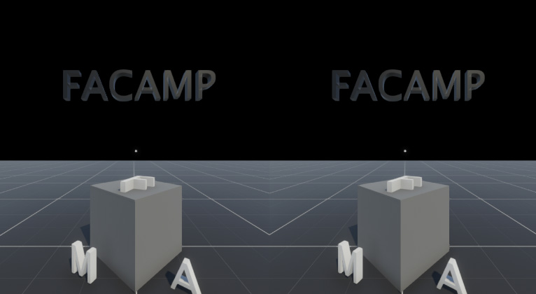

# Pula Corda - Jogo

SImpleR foi feito na Unity, para ser utilizado com óculos Stereoscópicos simples. O projeto foi construído sem assets prontos de XR, sendo criado com duas câmeras.

### Features
- Rotação de cameras
- Uso de controle bluetooth
- Reset de cena
- Coleta de objetos
